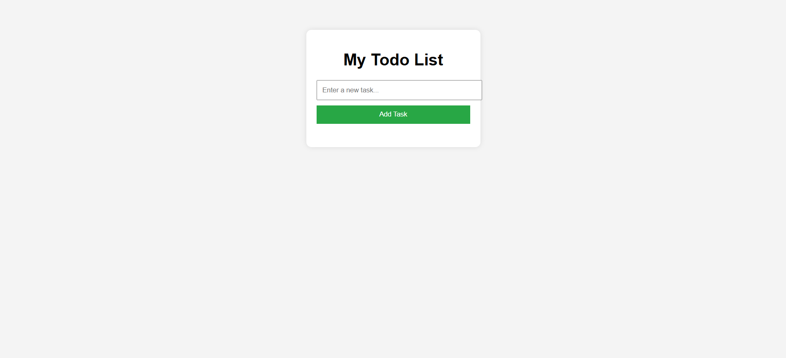

# 📝 Todo List Application

A simple web-based To-Do List app using HTML, CSS, and JavaScript.

## 🔧 Features
- Add new tasks
- Edit tasks
- Delete tasks

## 🚀 Getting Started

### Requirements
- A web browser (Chrome, Firefox, etc.)

### Instructions

1. Clone or download this repository.
2. Open the `index.html` file in your browser.
3. Start managing your tasks!

## 📁 Folder Structure

todo-app(js)/
├── index.html 
├── style.css 
├── script.js 
└── README.md 

## 🧠 Concepts Used
- DOM manipulation
- Event handling
- JavaScript arrays and objects
- Functional UI rendering

## 📸 Screenshot

## 📄 License
MIT License
